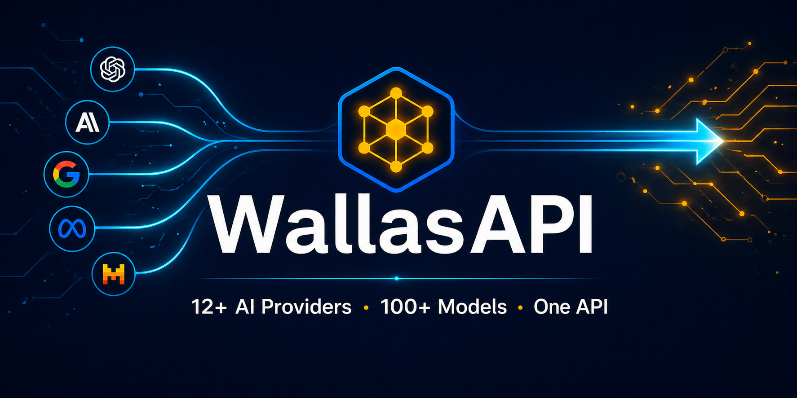

<div align="center">



# One API. 12+ AI Providers. 100+ Models. Zero Vendor Lock-in.

**The unified, OpenAI-compatible router that automatically picks the best AI provider for every request — and falls back transparently when one fails.**

[](https://www.python.org/)
[](https://fastapi.tiangolo.com/)
[](LICENSE)
[](#supported-providers)
[](#supported-providers)

[](#donations--why-this-matters)
[](https://ko-fi.com/wubjak)
[](https://paypal.me/wubjak)

**[English](README.md) · [Español](docs/i18n/README.es.md) · [中文](docs/i18n/README.zh.md) · [Português](docs/i18n/README.pt.md) · [Français](docs/i18n/README.fr.md) · [Deutsch](docs/i18n/README.de.md) · [日本語](docs/i18n/README.ja.md) · [한국어](docs/i18n/README.ko.md) · [Русский](docs/i18n/README.ru.md) · [العربية](docs/i18n/README.ar.md)**

</div>

---

> ## A Note from the Author — Please Read This
>
> Hi, I'm **Willen Ponce**. I built WallasAPI alone, in stolen hours between worrying about rent and the next meal, on a 2018 laptop, in a rented room in Peru that isn't mine.
>
> I have **no investors**. **No team**. **No company**. Just code, determination, and the desperate need to prove that you don't need Silicon Valley money to build something useful.
>
> If WallasAPI saves you even one hour of integration work, please consider:
> - ⭐ **[Starring this repo](https://github.com/wubjak/wallasapi)** — costs you nothing, helps me enormously
> - 💛 **[Buying me a coffee on Ko-fi](https://ko-fi.com/wubjak)** or **[via PayPal](https://paypal.me/wubjak)** — even $1 changes my day
> - 📧 **Sending an email to `wubjak@protonmail.ch`** — just say "I'm using WallasAPI for X". That's it. That's enough.
>
> [**Skip to the donation section →**](#donations--why-this-matters)

---

## Why WallasAPI Exists

You're building with AI in 2026. You face a real problem:

- 🔴 OpenAI goes down → your app dies
- 🔴 Your Claude API key expires → users complain
- 🔴 Gemini is free but doesn't accept your file format → manual conversion
- 🔴 You want to use a free model for cheap tasks and a powerful one for hard tasks → you write 200 lines of switching logic
- 🔴 Each provider has a different SDK, different format, different errors

**WallasAPI solves all of this with one OpenAI-compatible endpoint.** Send a request, and it:

1. **Analyzes the content** (text, image, audio, PDF, video)
2. **Picks the optimal provider** based on capabilities, speed, cost, and current availability
3. **Routes the request** automatically
4. **Falls back transparently** if the primary provider fails — your user never sees the error
5. **Returns the response** in standard OpenAI format, with streaming if you asked for it

**Your existing OpenAI SDK code works unchanged.** Just point it at `http://localhost:8001/v1`.

---

## What Makes This Different

Every feature here was built because **I needed it to ship products without a budget**:

| Feature | Why it matters |
|---|---|
| 🔄 **Multi-provider routing with auto-fallback** | If OpenAI goes down, Gemini takes over in milliseconds. Your app keeps working. |
| 🌊 **Real streaming with transparent fallback** | Token-by-token responses. If the primary provider dies mid-stream, fallback is invisible to the user. |
| 🧠 **Content-aware multimodal routing** | Send a PDF to Groq? It auto-OCRs it. Send a video to Gemini? Native processing. **You don't pick the provider — the content does.** |
| 📊 **Rich metadata for smart clients** | Every model exposes context window, pricing, tools support, modalities. Filter: `?pricing=free&capability=vision`. |
| 💾 **Persistent local memory** | Conversations saved as JSON, optionally synced to **Obsidian**. Your data stays yours. |
| 🎨 **Unified image/video/voice generation** | One endpoint, multiple providers (Flux, DALL-E, Pollinations, edge-tts, Gemini). |
| 📄 **OCR with fallback chain** | EasyOCR → Mistral → Gemini → local Ollama. No image goes unread. |
| 🔒 **100% private local models via Ollama** | Run Llama, Mistral, Qwen, DeepSeek offline. Zero data leaves your machine. |
| 🔗 **Google integration** | Drive, Calendar, Gmail with OAuth2. Project management with threads. |

---

## Supported Providers

| Provider | Capabilities | Pricing |
|---|---|---|
| **Gemini** (Google) | Chat, vision, audio, video, native files, image/video gen | **Free** |
| **Groq** | Ultra-fast Llama, Mixtral | **Free** |
| **GitHub Models** | GPT-4o, o1, o3, Mistral, Llama, Cohere | **Free** |
| **OpenRouter** | Claude, DeepSeek, Qwen + 100 more | Mixed |
| **Cerebras** | Ultra-fast Llama on proprietary HW | **Free** |
| **Pollinations** | Flux, SDXL image gen | **Free** |
| **Ollama** | Local Llama, Mistral, Qwen, DeepSeek | **Free** |
| **HuggingFace** | Community models, Spaces video | Mixed |
| **Cohere** | Command R, Command R+ | Paid |
| **Mistral AI** | Mistral Large, Medium, Pixtral | Paid |
| **NVIDIA NIM** | GPU-optimized enterprise LLMs | Paid |
| **OpenAI** | GPT-4o, GPT-4.1, DALL-E, Whisper, embeddings, TTS | Paid |

**With just Gemini + Groq + GitHub Models (all free) you have access to dozens of state-of-the-art models without paying a cent.**

---

## Quick Install (60 seconds)

### Windows — Just double-click `start.bat`

```bash
git clone https://github.com/wubjak/wallasapi.git
cd wallasapi
# Double-click start.bat
# Server is up at http://localhost:8001
```

### Linux / macOS

```bash
git clone https://github.com/wubjak/wallasapi.git
cd wallasapi
python3 -m venv .venv && source .venv/bin/activate
pip install -r requirements.txt
python -m wallasAPI.api_server
```

Interactive Swagger UI: **http://localhost:8001/docs**

---

## Quick Usage

```python
import openai

client = openai.OpenAI(
    base_url="http://localhost:8001/v1",
    api_key="anything-local"
)

# Don't pick a provider. Pick a strategy.
response = client.chat.completions.create(
    model="auto",  # WallasAPI picks the best free provider available NOW
    messages=[{"role": "user", "content": "Explain quantum entanglement"}]
)
print(response.choices[0].message.content)
```

**Virtual models you can use instead of guessing provider names:**

| Virtual model | Strategy |
|---|---|
| `auto` | Best available right now |
| `fast` | Lowest latency (Groq, Cerebras) |
| `standard` | Quality/speed/cost balance |
| `reasoning` | Deep thinking (DeepSeek R1, o1, o3, Gemini 2.5 Pro) |

---

## API Endpoints

OpenAI-compatible:
- `POST /v1/chat/completions` — chat with streaming
- `POST /v1/embeddings` — multi-provider embeddings
- `POST /v1/images/generations` — Flux, DALL-E, etc.
- `POST /v1/videos/generations` — Gemini, HuggingFace
- `POST /v1/tts` — text-to-speech

WallasAPI exclusive:
- `GET /v1/models?pricing=free&capability=vision` — filtered model discovery
- `GET /v1/models/{id}` — full metadata for any model
- `GET /v1/capabilities/summary` — aggregate stats
- `GET /v1/providers` — provider-level capabilities
- `POST /v1/ocr/process` — OCR with auto-fallback
- `POST /v1/sync/obsidian` — sync conversations to your vault

---

## Configuration

Copy `.env.example` to `.env` and fill in **only the keys you have**. WallasAPI works with whatever you give it.

```env
# 100% free providers (start here)
GEMINI_API_KEY=your_key
GROQ_API_KEY=your_key
GITHUB_TOKEN=your_token

# Optional paid
OPENAI_API_KEY=your_key
OPENROUTER_API_KEY=your_key
```

### How to get free API keys (step by step)

| Provider | Where | Time |
|---|---|---|
| **Gemini** | [ai.google.dev](https://ai.google.dev) → Get API key | 1 min |
| **Groq** | [console.groq.com](https://console.groq.com) → API Keys | 1 min |
| **GitHub Models** | [github.com/settings/tokens](https://github.com/settings/tokens) → classic token | 2 min |
| **OpenRouter** | [openrouter.ai](https://openrouter.ai) → Keys | 1 min |
| **Cerebras** | [cloud.cerebras.ai](https://cloud.cerebras.ai) → API Keys | 2 min |
| **Ollama** | [ollama.com](https://ollama.com) — install + `ollama run llama3.1` | 5 min |

**Total: ~10 minutes to get free access to 50+ state-of-the-art models.**

---

## License

MIT-based custom license. **Use, modify, distribute, deploy commercially — all free.** The only ask: keep the attribution to **Willen Ponce**.

**One personal request (not legally required):** If you use WallasAPI in any project, please send a one-line email to **wubjak@protonmail.ch**. A simple *"Hey, using WallasAPI for X"* literally makes my week. I built this alone and it would mean a lot to know it's helping someone.

See [`LICENSE`](LICENSE) for full text.

---

## Donations — Why This Matters

<div align="center">

### 🍞 Right now I cannot afford basic food. This is not a metaphor.

</div>

I'm not going to dress this up. I'm a developer in Peru who built this entire project — **17 modules, 12+ provider integrations, 1500+ lines of routing logic, OCR fallback chains, multimodal handling, persistent memory** — alone, on a 2018 laptop, in a rented room.

**I have no income right now.** I'm behind on rent. I haven't eaten properly in days while finishing this. I'm publishing it free because I believe open-source matters more than I matter, and because maybe — just maybe — someone reading this will find it useful and decide to help me eat tomorrow.

### What your donation actually does

| Amount | What it means for me |
|---|---|
| **$1** | A real bread + egg meal. Not symbolic. Real. |
| **$5** | A full day of food while I keep coding. |
| **$20** | A week where I don't have to choose between food and electricity. |
| **$100** | One month of rent. Stops me from being evicted. |
| **$400** | Six months of stability. I can dedicate that time fully to making WallasAPI better for you. |

**Every single dollar is documented in my conscience and remembered with gratitude.**

### How to send help

<div align="center">

[](https://paypal.me/wubjak)
[](https://ko-fi.com/wubjak)
[](mailto:wubjak@protonmail.ch)

</div>

**Yape / Plin (Peru) — Number: `980 702 580`**

<p align="center">
  
  &nbsp;&nbsp;&nbsp;&nbsp;
  
</p>

**Crypto wallets:**

| Currency | Address |
|---|---|
| **Bitcoin** | `bc1qwrr5zal3tt7f5ye0ptgy8365cc8yt64hrj7dmt` |
| **Ethereum** | `0xDec40634014bf05A40006BA48160cddAEe1143c2` |
| **Solana** | `HrTiFtmML4NJD1b3RrjQV3e1FgaBWgpqRtR6gFphApGh` |
| **Polygon** | `0xDec40634014bf05A40006BA48160cddAEe1143c2` |
| **Tron** | `TB1sHwCo3FFaabf26AHV8VNapWUJbca299` |
| **TronLink** | `TQsXuVbnSwicRNoCEmGVdFeo86X7ey7okx` |

### Can't donate? You can still help (it's free)

- ⭐ **Star this repo** — it costs you nothing and pushes WallasAPI into more developers' feeds
- 🐦 **Share it** on Twitter/X, LinkedIn, HackerNews, Reddit r/LocalLLaMA, your dev community
- 🐛 **Open an issue** if you find a bug or have a feature request
- 💬 **Send the email** to `wubjak@protonmail.ch` — it's not transactional, it's human

> *"I built WallasAPI because I refused to accept that being broke meant being unable to ship great software. If it helps you ship something — that's already a victory I'll never forget. If it helps me eat tomorrow — that's a victory neither of us will forget."* — **Willen Ponce**

---

## Acknowledgments

- The teams at **FastAPI**, **Google**, **Meta**, **DeepSeek**, **Mistral**, and every provider offering free tiers — you made this possible
- The **open-source community** — proof that we don't need billion-dollar valuations to build great things
- **You** — for reading this far. Whether you donate, star, share, or just use it: thank you

---

<div align="center">

### WallasAPI — One API to route them all

*Built from precarity. Maintained with stubbornness. Shared with hope.*

**[⭐ Star](https://github.com/wubjak/wallasapi) · [💛 Donate](#donations--why-this-matters) · [📧 Email me](mailto:wubjak@protonmail.ch)**

</div>
