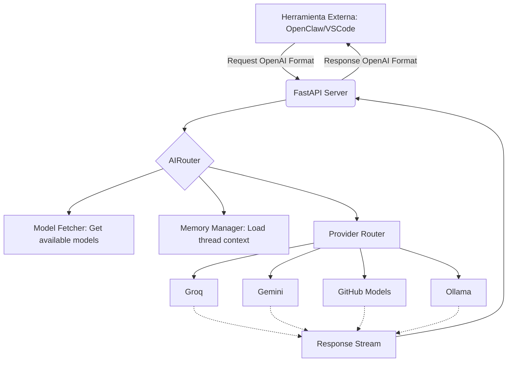

# Análisis Exhaustivo del Sistema AI_SERVICES

## Introducción
Este documento detalla el funcionamiento, la arquitectura y las capacidades del paquete `ai_services`, diseñado para actuar como un enrutador inteligente y agnóstico de proveedores de Inteligencia Artificial (LLMs). El sistema está optimizado para el uso de modelos gratuitos, orquestación multimodal y gestión de contexto persistente.

---

## 🏗️ Arquitectura del Sistema

El paquete sigue una estructura modular donde cada componente tiene una responsabilidad única y clara.

### 1. `router.py`: El Cerebro de Orquestación
Es la pieza central. Define la clase `AIRouter`, que maneja dos flujos principales:
- **Sincrónico (`get_completion`)**: Para respuestas directas.
- **Asincrónico/Streaming (`stream_completion`)**: Proporciona una respuesta fluida token a token, soportando además metadatos de razonamiento (pensamiento del modelo).

**Características Clave:**
- **Selección Inteligente de Modelos**: Permite definir un proveedor y modelo preferido, o iterar automáticamente sobre un registro de modelos si el preferido falla o no está definido.
- **Multimodalidad Unificada**: Normaliza el envío de imágenes, archivos (vía inyección de contexto) y audio (específicamente para Gemini).
- **Manejo de Errores y Fallover**: Si un modelo falla (por ejemplo, por límites de cuota 429), el enrutador puede pasar al siguiente modelo disponible en el `MODELS_REGISTRY`.
- **Soporte de Razonamiento (Reasoning/Thinking)**: Implementa la lógica para capturar bloques de "pensamiento" en modelos como DeepSeek R1 o Gemini 2.0 Thinking.

### 2. `model_fetcher.py`: El Descubridor Dinámico
En lugar de tener una lista estática de modelos que se desfasa, este componente consulta las APIs de los proveedores en tiempo real al iniciar el sistema.

- **Detección de Capacidades**: Utiliza heurísticas avanzadas para clasificar modelos por sus nombres (ej. si contiene "vision" lo marca como capaz de visión; si contiene "flash" o "free" lo marca como gratuito).
- **Ollama Cloud Integration**: Incluye una lista predefinida de modelos que Ollama soporta en la nube, además de listar los modelos instalados localmente.
- **Normalización de Formato**: Convierte las respuestas dispares de GitHub, Groq, Mistral, OpenRouter, Gemini y Ollama a un formato interno común.

### 3. `config.py`: Definición de Proveedores
Contiene la configuración de los "Base URLs" y los nombres de las variables de entorno para las API Keys.
- Soporta: **GitHub Models, Groq, SambaNova, Mistral, OpenRouter, Gemini, Cerebras, Cohere y Ollama (Local/Cloud).**

### 4. `memory.py`: Persistencia del Contexto
Implementa un `MemoryManager` basado en archivos JSON (`temp_context/thread_*.json`).
- **Isolation por Threads**: Cada conversación tiene su propio ID de hilo.
- **Auto-trimming**: Limita el historial a los últimos 20 mensajes para evitar el consumo excesivo de tokens y mantenerse dentro de los límites de contexto de los modelos gratuitos.

### 5. `file_utils.py` y `search_tool.py`: Enriquecimiento de Contexto
- **FileProcessor**: Extrae texto de archivos para inyectarlo como contexto en modelos que no soportan carga directa de archivos.
- **SearchTool**: Capacidad experimental de búsqueda web (actualmente conectada para inyectar resultados en el contexto de Ollama).

---

## 🚀 Posibilidades y Capacidades

### 1. Integración con IDEs y Herramientas Externas
Para que herramientas como **OpenClaw, Papperlip AI, OpenFang, ClaudeCoe o OpenClaude Code** puedan usar este sistema, el siguiente paso es exponer el `AIRouter` a través de una API con **formato OpenAI compatible**.

### 2. Agregador de Modelos Gratuitos
El sistema está diseñado para maximizar el uso de "Free Tiers". Al centralizar Groq (Llama 3), GitHub (GPT-4o/o1), Gemini (Pro/Flash) y SambaNova en un solo punto, se crea un "Super-Provider" gratuito prácticamente ilimitado.

### 3. Orquestación Multimodal
- **Visión**: Análisis de imágenes centralizado.
- **Audio**: Soporte nativo de audio vía Gemini.
- **Documentos**: Análisis de PDFs/Textos vía inyección de contexto.

---

## 🛠️ Próximo Paso: Implementación como API/Servicio

Para convertir este paquete en un servicio listo para otros IDEs, debemos crear un servidor (usando **FastAPI**) que actúe como un proxy inteligente.

### Requerimientos para el Servicio:
1.  **Endpoint `/v1/chat/completions`**: Debe imitar exactamente la respuesta de OpenAI para que cualquier herramienta (como OpenClaw) solo necesite cambiar el `base_url`.
2.  **Streaming Proxy**: Reenviar los chunks del `AIRouter` manteniendo el formato SSE (Server-Sent Events).
3.  **Selector de Modelo por Cabecera o Body**: Permitir que el cliente elija el modelo, o dejar que el sistema elija el mejor disponible automáticamente.
4.  **Middleware de Seguridad**: Si se va a exponer públicamente, añadir una API Key propia para controlar el acceso al enrutador.

### Diagrama de Flujo del Servicio Propuesto:

---

## 📝 Conclusión y Estrategia
El sistema `ai_services` es una base sólida y profesional. No es solo un wrapper, sino un **orquestador resiliente**. Su fortaleza radica en la capacidad de manejar fallos de proveedores de forma transparente para el usuario final.

La implementación del servicio API (FastAPI) permitirá que este proyecto no sea solo un script interno, sino un **Backend de LLMs personal** que alimente todo tu ecosistema de desarrollo.

> [!TIP]
> **Prioridad:** Implementar el servidor FastAPI con compatibilidad total de OpenAI para "conectar y listo" con cualquier plugin de VSCode o herramienta de agentes.
