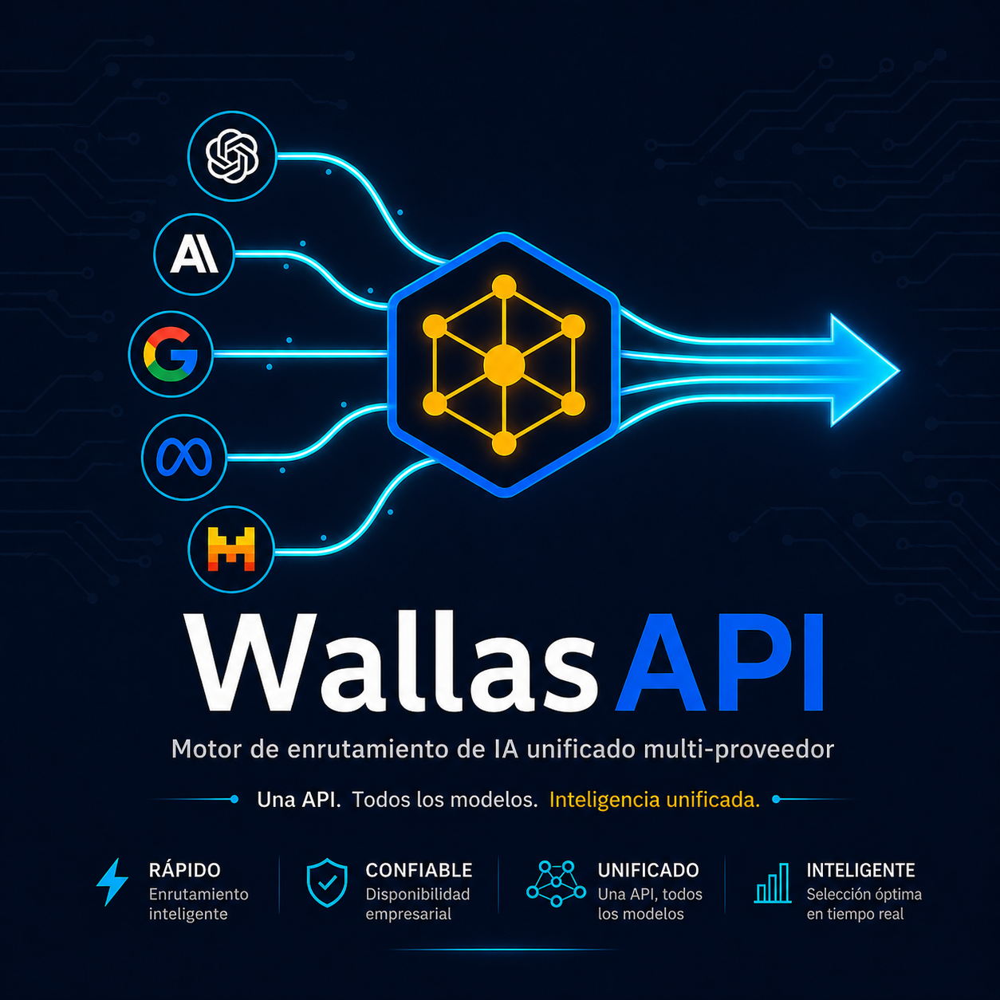

<p align="center">
  
</p>

<p align="center">
  
  
  
  
  
</p>

<p align="center">
  <a href="https://ko-fi.com/wubjak"></a>
  <a href="https://paypal.me/wubjak"></a>
  <a href="../../README.md"></a>
</p>

<p align="center"><strong>El Enrutador Inteligente Multi-Proveedor de IA Definitivo</strong></p>

<p align="center"><em>Construido con sudor, determinacion y una laptop del 2018, desde la precariedad de un cuarto alquilado, por <strong>Willen Ponce</strong></em></p>

---

## Por que WallasAPI existe: Una historia que importa

No naci con un MacBook Pro M4. No tengo servidores en la nube financiados por inversionistas de Silicon Valley. No tengo un equipo de 50 ingenieros detras de mi. **Lo que tengo es una laptop del 2018, un cuarto alquilado que no es mio, y una obsesion: demostrar que desde la precariedad se puede construir algo que compite con las corporaciones.**

WallasAPI nacio en las horas robadas entre preocupaciones por la renta, por el siguiente plato de comida, por poder dormir al menos cuatro horas seguidas sin despertar pensando en cuanto debo. No tenia dinero para pagar APIs caras. No tenia una empresa respaldandome. Solo tenia una pregunta obsesiva:

> **"Por que deberia depender de un solo proveedor de IA cuando el mundo entero de modelos esta ahi afuera, muchos gratis, muchos mejores para tareas especificas?"**

Asi que lo construi. **Linea por linea de Python. Sin frameworks lujosos. Sin equipos. Sin inversores.** Solo codigo puro, heuristicas inteligentes, y la necesidad desesperada de crear algo que funcione. Porque cuando no tienes nada que perder, cada linea de codigo es una apuesta contra la desesperanza.

**WallasAPI no es solo software. Es supervivencia tecnologica.** Es el router que no te cobra por ser inteligente. Es el sistema que no te deja colgado cuando OpenAI se cae, cuando tu API key de Claude expira, o cuando tu proveedor favorito decide subir los precios. Sabe cuando usar **Gemini** (gratis), cuando usar **Groq** (ultra-rapido), cuando usar **DeepSeek R1** (razonamiento profundo), cuando usar tu propio **Ollama local** (100% privado).

**Y lo hace todo automaticamente.**

---

## Que es WallasAPI?

WallasAPI es un **motor de routing unificado** que conecta tu aplicacion, IDE o agente con **mas de 12 proveedores de IA** (y creciendo) a traves de **una sola API 100% compatible con OpenAI**.

No necesitas integrar 12 SDKs diferentes. No necesitas memorizar que modelo acepta imagenes, cual es gratis, cual soporta streaming, cual tiene contexto de 1 millon de tokens. **WallasAPI lo sabe por ti. Y lo expone para que tu cliente lo descubra automaticamente.**

Cuando envias un prompt, WallasAPI:
1. **Analiza el contenido** (texto, imagen, audio, PDF, video)
2. **Selecciona el proveedor optimo** basado en capacidades, velocidad, disponibilidad y costo
3. **Enruta la peticion** automaticamente
4. **Si falla el proveedor primario**, hace fallback transparente al siguiente sin que tu usuario lo note
5. **Devuelve la respuesta** en formato OpenAI-compatible, con streaming si lo solicitaste

**Tu codigo existente funciona sin cambios.** Solo cambia la URL base.

---

## Caracteristicas que Cambian las Reglas

Cada una de estas features fue construida porque la necesite para sobrevivir como desarrollador sin presupuesto:

### 1. Enrutamiento Inteligente Multi-Proveedor con Fallback Automatico
Falla OpenAI? Sin drama. WallasAPI cambia a **Gemini** en milisegundos. Se cae Groq? Rutea a **Cerebras** o **Ollama local** instantaneamente. No hay un solo punto de fallo. Tu aplicacion **nunca se queda sin respuesta.**

### 2. Streaming Real con Transparencia Total
Las respuestas llegan token por token en tiempo real, exactamente como OpenAI. Pero si el proveedor primario falla a mitad del stream? **El fallback es completamente transparente.** Tu usuario no nota que cambio de proveedor debajo.

### 3. Soporte Multimodal que Piensa por Ti
Texto, imagenes, audio, video, PDFs. Aqui esta la magia: **el router decide QUIEN puede procesar QUE.** Quieres enviar un PDF a Groq? WallasAPI sabe que Groq no acepta archivos nativos, asi que extrae el texto automaticamente con OCR y lo envia. Quieres enviar un video a Gemini? Lo procesa nativo sin conversiones. **Tu no decides el proveedor. El contenido decide.**

### 4. Metadata Enriquecida para Clientes Inteligentes
Cada modelo expone metadata completa: context window, pricing tier, tools, streaming, razonamiento, modalidades de entrada/salida, maximo de imagenes por request. Tu IDE puede preguntar: "dame solo modelos gratis con vision que acepten archivos nativos" y WallasAPI responde filtrado automaticamente.

### 5. Memoria Persistente que Respeta tu Privacidad
Conversaciones con historial guardado localmente en JSON. Sincronizable con **Obsidian** para quienes viven en notas interconectadas. Tu historial no se va a la nube si no quieres.

### 6. Generacion de Imagen, Video y Voz Unificada
Un solo endpoint para crear contenido multimodal desde multiples proveedores:
- **Imagen**: Gemini, Pollinations (Flux, SDXL), HuggingFace, OpenAI DALL-E, NVIDIA NIM, Ollama local
- **Video**: Gemini, HuggingFace Spaces
- **Texto a Voz (TTS)**: OpenAI, edge-tts con multiples voces

### 7. OCR con Cadena de Fallback
Extrae texto de imagenes y PDFs con **EasyOCR** -> **Mistral** -> **Gemini** -> **Ollama local**. Si el primero falla, prueba el siguiente. No deja una imagen sin leer.

### 8. Modelos Locales 100% Privados via Ollama
Corre **Llama 3, Mistral, Qwen, DeepSeek** completamente gratis y privado en tu propia maquina. Sin API keys. Sin internet. Sin que nadie lea tus prompts.

### 9. Integracion Google Completa
Drive, Calendar, Gmail con OAuth2. Recordatorios locales que se sincronizan con Google Calendar. Gestion de proyectos con threads, archivos y metadata.

---

## Sistema de Metadata Enriquecida: El Cerebro que Construimos

Cuando tienes cientos de modelos dispersos en docenas de proveedores, la pregunta no es "cual uso?" La pregunta es: **"Este modelo acepta imagenes? Cual es su context window? Es gratis? Soporta tools? Puedo enviarle un PDF nativo o necesito extraer texto primero?"**

WallasAPI responde automaticamente con metadata exacta para cada modelo:

```json
{
  "context_window": 128000,
  "max_images_per_request": 5,
  "supports_tools": true,
  "supports_streaming": true,
  "supports_reasoning_stream": false,
  "input_modalities": ["text", "image", "audio"],
  "output_modalities": ["text"],
  "pricing_tier": "free",
  "provider_limits": {
    "max_images_per_request": 5,
    "supports_tools": true,
    "supports_streaming": true,
    "max_context_hint": 128000,
    "pricing": "free"
  }
}
```

### Heuristicas Automaticas Probada por 17 Tests

| Familia | Context Window | Tools | Streaming | Vision | Audio | Archivos Nativos |
|---|---|---|---|---|---|---|
| Gemini 2.5 Pro | 1,000,000 | Si | Si | Si | Si | Si |
| Gemini 1.5 Pro | 2,000,000 | Si | Si | Si | Si | Si |
| GPT-4o / 4.1 | 128K - 1M | Si | Si | Si | No | No |
| Claude 3 | 200,000 | Si | Si | Si | No | No |
| Llama 3.3 (Groq) | 128,000 | Si | Si | Si | No | No (shim auto) |
| DeepSeek R1 | 64,000 | Si | Si | No | No | No |
| Llama 3.1 (Cerebras) | 8,192 | No | Si | No | No | No |
| Flux (Pollinations) | N/A | No | No | No | No | Solo genera imagenes |

**Como funciona:** Lee el nombre del modelo, detecta patrones (`vision`, `vl`, `audio`, `reasoning`, `r1`), consulta limites del proveedor, y construye metadata automaticamente. No es magia. Es codigo escrito a mano a las 3 AM en una laptop del 2018.

---

## API Endpoints

### Chat Completions (100% OpenAI-compatible)

| Endpoint | Metodo | Descripcion |
|---|---|---|
| `POST /v1/chat/completions` | Chat | Completions con streaming. Soporta modelos virtuales: `auto`, `rapido`, `standard`, `razonamiento`. |
| `POST /v1/embeddings` | Embeddings | Routing multi-proveedor (NVIDIA, OpenAI, Ollama). |
| `POST /v1/tts` | TTS | Texto a voz con multiple proveedores. |
| `POST /v1/images/generations` | Imagen | Generacion de imagenes unificada. |
| `POST /v1/videos/generations` | Video | Generacion de video unificada. |

### Metadata Inteligente

| Endpoint | Descripcion |
|---|---|
| `GET /v1/models` | Lista modelos con metadata completa. Filtros: `?pricing=free`, `?capability=vision`, `?provider=groq`, `?search=llama`, `?modality=audio`. |
| `GET /v1/models/{id}` | Metadata detallada de un modelo especifico. |
| `GET /v1/capabilities/summary` | Resumen agregado: cuantos gratis, cuantos con vision, audio, reasoning, streaming, generacion, archivos nativos. |
| `GET /v1/providers` | Metadata global por proveedor: requiere auth, soporta vision/audio/archivos nativos, modalidades, pricing. |

### Servicios Premium

| Endpoint | Descripcion |
|---|---|
| `POST /v1/ocr/process` | OCR con cadena de fallback (EasyOCR -> Mistral -> Gemini -> Ollama). |
| `POST /v1/interpret` | Analisis de imagenes con descripcion textual. |
| `POST /v1/sync/obsidian` | Sincronizacion de memoria con Obsidian. |
| `GET /v1/health` | Health check del sistema. |

---

## Modelos Virtuales: Estrategia, No Proveedor

En lugar de decir "usa gpt-4o" y cruzar los dedos, usas modelos **virtuales** que el router resuelve inteligentemente:

| Virtual | Estrategia | Proveedores tipicos |
|---|---|---|
| `auto` | Seleccion automatica por capacidad + velocidad + disponibilidad | El mejor disponible ahora |
| `rapido` | Minima latencia, respuestas instantaneas | Groq, Cerebras |
| `standard` | Balance calidad/velocidad/costo | Gemini, GPT-4o, Llama 70B |
| `razonamiento` | Pensamiento profundo antes de responder | DeepSeek R1, o1, o3, Gemini 2.5 Pro |

---

## Proveedores Soportados

| Proveedor | Capacidades | Pricing |
|---|---|---|
| **Gemini** (Google) | Chat, vision, audio, video, archivos nativos, generacion imagen/video | **Gratis** |
| **Groq** | LLMs ultra-rapidos (Llama, Mixtral) | **Gratis** |
| **GitHub Models** | GPT-4o, o1, o3, Mistral, Llama, Cohere | **Gratis** |
| **OpenRouter** | Acceso unificado (Claude, DeepSeek, Qwen, etc.) | Mixto |
| **Cohere** | Command R, Command R+ | Pago |
| **Mistral** | Mistral Large, Medium, Small | Pago |
| **Ollama** | Modelos locales totalmente privados | **Gratis** |
| **NVIDIA NIM** | LLMs optimizados en GPU | Pago |
| **Cerebras** | Inferencia ultra-rapida en hardware propio | **Gratis** |
| **Pollinations** | Generacion imagen/video (Flux, etc.) | **Gratis** |
| **HuggingFace** | Modelos de la comunidad | Mixto |
| **OpenAI** | GPT-4o, GPT-4.1, embeddings, TTS, DALL-E | Pago |

**Gratis + Rapido + Privado + Pago = Todos conviven.** Tu decides cuales usar. WallasAPI decide automaticamente cual es el mejor en cada momento.

---

## Instalacion Rapida

### Windows (Recomendado: Doble-click en `start.bat`)

```bash
# 1. Clonar el repositorio
git clone https://github.com/tu-usuario/wallasapi.git
cd wallasapi

# 2. Doble-click en start.bat
#    - Crea entorno virtual automaticamente
#    - Instala dependencias
#    - Inicia el servidor en http://localhost:8001

# O manualmente:
python -m venv .venv
.venv\Scripts\activate
pip install -r requirements.txt
python -m wallasAPI.api_server
```

### Linux / macOS

```bash
git clone https://github.com/tu-usuario/wallasapi.git
cd wallasapi
python3 -m venv .venv
source .venv/bin/activate
pip install -r requirements.txt
python -m wallasAPI.api_server
```

El servidor inicia en **http://localhost:8001**

Documentacion interactiva (Swagger UI): **http://localhost:8001/docs**

---

## Configuracion

Crea un archivo `.env` en la raiz del proyecto con las API keys de los proveedores que quieras usar. **No necesitas todas.** WallasAPI funciona con las que tengas.

```env
# Proveedores gratuitos (recomendados para empezar)
GEMINI_API_KEY=tu_gemini_key_aqui
GROQ_API_KEY=tu_groq_key_aqui
GITHUB_TOKEN=tu_github_token_aqui

# Proveedores de pago (opcionales)
OPENAI_API_KEY=tu_openai_key_aqui
OPENROUTER_API_KEY=tu_openrouter_key_aqui
COHERE_API_KEY=tu_cohere_key_aqui
MISTRAL_API_KEY=tu_mistral_key_aqui
NVIDIA_API_KEY=tu_nvidia_key_aqui

# Seguridad (opcional, para despliegue en VPS)
PROXY_API_KEY=tu_clave_secreta_para_proteger_endpoints

# Ollama no requiere API key — corre localmente gratis
```

---

## Registro en Proveedores: Como Conseguir Claves Gratuitas (Paso a Paso)

**IMPORTANTE:** Cada usuario debe usar SU PROPIA clave API. **NO compartas tu archivo `.env` y NO subas tus claves a GitHub.** Obtener claves gratuitas es rapido y te da control total.

### Proveedores 100% Gratuitos (Empieza aqui)

| Proveedor | Para que sirve | Como registrarse y obtener tu clave |
|---|---|---|
| **Gemini (Google)** | Modelos Gemini 2.0/2.5 Pro/Flash con 1M-2M de contexto, vision, audio, video, archivos nativos | 1. Ve a [ai.google.dev](https://ai.google.dev)<br>2. Click en "Get API key in Google AI Studio"<br>3. Inicia sesion con tu cuenta Google<br>4. Ve a la pestana "Get API key"<br>5. Click "Create API key"<br>6. Copia la key y pegala en `GEMINI_API_KEY=...` |
| **Groq** | LLMs ultra-rapidos (Llama 3.3 70B, Mixtral, Gemma) con latencia de 100-300ms | 1. Ve a [console.groq.com](https://console.groq.com)<br>2. Click en "Sign Up" (correo o Google/GitHub)<br>3. Ve a la seccion "API Keys"<br>4. Click "Create API Key"<br>5. Copia la key y pegala en `GROQ_API_KEY=...` |
| **GitHub Models** | Acceso gratis a GPT-4o, o1, o3, Mistral, Llama, Cohere | 1. Necesitas una cuenta GitHub (gratis)<br>2. Ve a [github.com/settings/tokens](https://github.com/settings/tokens)<br>3. Click "Generate new token (classic)"<br>4. Marca permisos basicos (no necesita scopes especiales)<br>5. Genera y copia el token<br>6. Pegalo en `GITHUB_TOKEN=...`<br>7. Tambien regístrate en modelos: [github.com/marketplace/models](https://github.com/marketplace/models) |
| **OpenRouter** | Puerta de acceso unificada a Claude, DeepSeek, Qwen, y mas de 100 modelos | 1. Ve a [openrouter.ai](https://openrouter.ai)<br>2. Click "Sign Up" (correo o Google/GitHub/Twitter)<br>3. Ve a "Keys" en el panel lateral<br>4. Click "Create Key"<br>5. Copia la key y pegala en `OPENROUTER_API_KEY=...`<br>6. Muchos modelos son gratis con rate limits generosos |
| **Cerebras** | Inferencia ultra-rapida en hardware Cerebras (Llama 3.1-8B) | 1. Ve a [cloud.cerebras.ai](https://cloud.cerebras.ai)<br>2. Sign up con correo<br>3. Ve a la seccion "API Keys"<br>4. Genera una nueva key<br>5. Pegala en tu `.env` |
| **Pollinations** | Generacion de imagenes (Flux, SDXL) y video completamente gratis | 1. Ve a [pollinations.ai](https://pollinations.ai)<br>2. No requiere API key para uso basico<br>3. Para API: regístrate y obtén key en la documentacion<br>4. Nota: WallasAPI usa el endpoint publico de Pollinations que no requiere auth |
| **Ollama** | Modelos locales 100% privados (Llama, Mistral, Qwen, DeepSeek) | 1. Descarga [ollama.com](https://ollama.com) e instala<br>2. Ejecuta `ollama run llama3.1`<br>3. WallasAPI detecta Ollama automaticamente en `localhost:11434`<br>4. **NO necesita API key — 100% gratis y privado** |

### Proveedores de Pago (Opcionales, si necesitas mas)

| Proveedor | Para que sirve | Como registrarse |
|---|---|---|
| **OpenAI** | GPT-4o, GPT-4.1, DALL-E, Whisper, embeddings, TTS | [platform.openai.com](https://platform.openai.com) — Sign up, agrega tarjeta de credito/prepago |
| **Mistral AI** | Mistral Large, Medium, Pixtral | [console.mistral.ai](https://console.mistral.ai) — Registro con $5 de credito gratis inicial |
| **Cohere** | Command R, Command R+ | [cohere.com](https://cohere.com) — Registro con credito gratis de prueba |
| **NVIDIA NIM** | LLMs optimizados en GPU enterprise | [build.nvidia.com](https://build.nvidia.com) — Registro con credito gratis inicial |

### Consejos de Seguridad

- **NUNCA subas tu `.env` a GitHub.** Usa `.gitignore` para excluirlo.
- **Usa variables de entorno** en produccion en lugar de archivos `.env`.
- **Rota tus claves** periodicamente desde los paneles de cada proveedor.
- **Monitorea el uso** en los dashboards de cada proveedor para no exceder limites gratuitos.

Con solo **Gemini + Groq + GitHub Models** tienes acceso a decenas de modelos potentisimos sin pagar un centavo. Empieza con esos tres.

---

## Uso Rapido

### Chat basico con modelo virtual

```python
import openai

client = openai.OpenAI(
    base_url="http://localhost:8001/v1",
    api_key="cualquier-cosa-local"  # o tu PROXY_API_KEY si lo configuraste
)

# Elige la estrategia, no el proveedor
response = client.chat.completions.create(
    model="auto",  # WallasAPI elige el mejor proveedor disponible
    messages=[{"role": "user", "content": "Explica la relatividad general"}]
)
print(response.choices[0].message.content)
```

### Streaming con fallback automatico

```python
for chunk in client.chat.completions.create(
    model="rapido",  # Prioriza velocidad (Groq, Cerebras)
    messages=[{"role": "user", "content": "Hola"}],
    stream=True
):
    print(chunk.choices[0].delta.content or "", end="")
```

### Descubrir modelos gratis con vision

```bash
curl "http://localhost:8001/v1/models?pricing=free&capability=vision"
```

### Ver si un modelo soporta archivos nativos

```bash
curl "http://localhost:8001/v1/providers"
# Gemini: supports_native_files = true (envia PDFs directo)
# Groq: supports_native_files = false (usa OCR automatico)
```

### Generar una imagen

```python
image = client.images.generate(
    model="flux",  # Pollinations, gratis
    prompt="Un gato astronauta en el espacio, estilo pixel art"
)
```

---

## Estructura del Proyecto

```
wallasAPI/
├── api_server.py          # FastAPI server con endpoints OpenAI-compatible
├── router.py              # Motor de routing inteligente con fallback
├── config.py              # Configuracion, metadata schema, heuristics
├── model_fetcher.py         # Descubrimiento dinamico de modelos
├── file_utils.py           # OCR, extraccion de texto, procesamiento de archivos
├── memory.py              # Memoria persistente de conversaciones
├── google_service.py      # Integracion Google OAuth2
├── reminders.py           # Sistema de recordatorios
├── projects.py            # Gestion de proyectos
├── settings.py            # Preferencias de usuario
├── logger.py              # Logging centralizado
├── providers/             # Proveedores individuales
│   ├── huggingface.py
│   └── ...
├── start.bat              # Script para iniciar en Windows (doble-click)
├── requirements.txt       # Dependencias
├── LICENSE                # Licencia personalizada
└── README.md              # Este archivo
```

---

## Licencia

Este proyecto esta licenciado bajo una licencia personalizada basada en MIT.

**Puedes usarlo, modificarlo, distribuirlo y construir sobre ello libremente.** La unica condicion real es que mantengas la atribucion a **Willen Ponce** como autor original.

**Una peticion personal (no legalmente obligatoria):** Si usas WallasAPI en algun proyecto, producto, servicio o despliegue — ya sea comercial o no — te agradeceria enormemente que me enviaras un correo a **wubjak@protonmail.ch** contandome que estas usando WallasAPI. No necesitas compartir detalles tecnicos ni informacion propietaria. Un simple **"Hey, estoy usando WallasAPI para X, gracias por construirlo"** es suficiente para que el dia de un desarrollador que construyo esto en una laptop del 2018 desde un cuarto alquilado sea mucho mejor.

Ver archivo `LICENSE` para el texto completo.

---

## Donaciones: Mantener Esto Vivo

Este proyecto no tiene patrocinadores. No tiene inversionistas de Silicon Valley. No tiene un equipo de marketing. Tiene una laptop del 2018, un cuarto alquilado, y codigo que funciona.

**Si WallasAPI te ahorro horas de integracion, te ayudo a construir algo genial, o simplemente crees que el software libre deberia existir sin depender de corporaciones multimillonarias:**

### Tu apoyo directo cambia absolutamente todo:

- **PayPal**: [paypal.me/wubjak](https://paypal.me/wubjak)
- **Ko-fi**: [ko-fi.com/wubjak](https://ko-fi.com/wubjak) — Cada cafecito cuenta.
- **Email**: wubjak@protonmail.ch

**Yape / Plin (Peru) — Numero: 980 702 580**

<p align="center">
  
  
</p>

**Crypto Wallets:**

| Moneda | Direccion |
|---|---|
| **Ethereum** | `0xDec40634014bf05A40006BA48160cddAEe1143c2` |
| **Bitcoin** | `bc1qwrr5zal3tt7f5ye0ptgy8365cc8yt64hrj7dmt` |
| **Solana** | `HrTiFtmML4NJD1b3RrjQV3e1FgaBWgpqRtR6gFphApGh` |
| **Polygon** | `0xDec40634014bf05A40006BA48160cddAEe1143c2` |
| **Tron** | `TB1sHwCo3FFaabf26AHV8VNapWUJbca299` |
| **TronLink** | `TQsXuVbnSwicRNoCEmGVdFeo86X7ey7okx` |

> *"Antes de que me boten de la casa, para poder desayunar, pagar mis deudas, y poder dormir al menos 4 horas seguidas sin despertar pensando en cuanto debo, todo aporte cuenta. Gracias por usar WallasAPI."* — **Willen Ponce**

---

## Agradecimientos

- A los creadores de FastAPI, por hacer APIs en Python algo hermoso.
- A Google, Meta, DeepSeek, Mistral, y todos los proveedores que ofrecen modelos gratuitos.
- A la comunidad open-source, que demuestra que el software libre puede competir con cualquier corporacion.
- **A ti**, por leer hasta aqui y considerar usar WallasAPI.

---

<p align="center">
  <strong>WallasAPI</strong> — <em>Una API para gobernarlos a todos.<br>
  Construida desde la precariedad, con la determinacion de quien no tiene nada que perder.</em>
</p>
